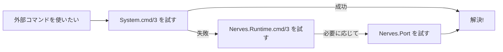

## はじめに

Nerves のプロジェクトを進める中で、外部コマンドを使う場面に出会うことがあります。例えば、システム情報の取得や特定のデバイスファイルへのアクセスです。Elixir には外部コマンドを実行する方法がいくつかあり、それぞれ特有の使い方とメリットがあります。

この記事では、[`Nerves.Runtime.cmd/3`][nerves-runtime-cmd3]、[`Nerves.Port`][nerves-port-docs]、[`System.cmd/3`][system-cmd3] の違いを比較し、どの場面でどれを使うべきかを考えてみます。

やり方はたくさんありますが、特に Nerves で有用と思われるものを 3 種類の挙げます。

1. **[`System.cmd/3`][system-cmd3]**: Elixir 標準のコマンド実行関数。
2. **[`Nerves.Runtime.cmd/3`][nerves-runtime-cmd3]**: Nerves のランタイム環境向けに設計されたコマンド実行関数。
3. **[`Nerves.Port`][nerves-port-docs]**: プロセス管理の拡張機能を備えた Nerves 用のコマンド実行モジュール。

外部プロセスを管理する際の設計方針については、以下の記事も参考になります。

https://qiita.com/hisaway/items/ea80b50fef410a2e5432

https://qiita.com/mnishiguchi/items/b8c1d5b11889a37ee17e

https://qiita.com/mnishiguchi/items/e69ca51daef43e1661f4

## 外部コマンドの実行方法の比較

| 特徴                     | [`System.cmd/3`][system-cmd3]             | [`Nerves.Runtime.cmd/3`][nerves-runtime-cmd3] | [`Nerves.Port`][nerves-port-docs]            |
| ------------------------ | ----------------------------------------- | --------------------------------------------- | -------------------------------------------- |
| **概要**                 | 標準的な外部コマンド実行                  | Nerves 環境向けの軽量な API                   | プロセス管理を拡張したコマンド実行           |
| **ユースケース**         | 簡単なコマンドの実行                      | Nerves プロジェクトでの基本的な操作           | 高度なプロセス制御やカスタマイズ             |
| **メリット**             | - 簡単に使える<br>- Elixir 標準で利用可能 | - 軽量<br>- 環境に最適化されている            | - SIGKILL 遅延やプロセス名設定が可能         |
| **デメリット**           | - 制御機能が限られている                  | - カスタマイズ性が低い                        | - `priv/port` バイナリが必要<br>- 設定が複雑 |
| **入出力のリダイレクト** | 可能                                      | 可能                                          | 可能                                         |
| **SIGKILL の遅延**       | なし                                      | なし                                          | あり                                         |
| **カスタムプロセス名**   | なし                                      | なし                                          | あり                                         |
| **利用可能な環境**       | どこでも利用可能                          | Nerves プロジェクトのみ                       | Nerves プロジェクトまたは特別な設定時のみ    |

## どれを使うべきか？

それぞれの方法には特有の強みがあり、プロジェクトの要件に応じて使い分けるのが良いと思います。



### [`System.cmd/3`][system-cmd3]

簡単な外部コマンドを実行する場合に便利です。

#### 実例: CPU 温度の取得

```elixir
{output, status} = System.cmd("cat", ["/sys/class/thermal/thermal_zone0/temp"])

case status do
  0 ->
    output
    |> String.trim()
    |> String.to_integer()
    |> Kernel./(1000)
    |> IO.puts("CPU 温度: #{&1} 度")
  _ ->
    IO.puts("エラーが発生しました。温度を読み取れませんでした。")
end
```

このコードは、`/sys/class/thermal/thermal_zone0/temp` に保存された CPU 温度を読み取ります。

### [`Nerves.Runtime.cmd/3`][nerves-runtime-cmd3]

Nerves プロジェクトでの標準的なコマンド実行に最適です。

#### 実例: ディレクトリ全体のコピー

```elixir
{output, status} = Nerves.Runtime.cmd("cp", ["-r", "/source_dir", "/target_dir"])

case status do
  0 -> IO.puts("ディレクトリのコピーが成功しました。")
  _ -> IO.puts("ディレクトリのコピー中にエラーが発生しました。")
end
```

このコードは、Nerves 環境でディレクトリをコピーするために使用されます。

:::note info
実はファイル操作のために外部コマンドを使う必要はありません。Elixir の [`File` モジュール][file-docs] を使えば、同様の操作が簡単に行えます。

例えば、ディレクトリのコピーは以下のように記述できます。

```elixir
File.cp_r!("/source_dir", "/target_dir")
```
:::

### [`Nerves.Port`][nerves-port-docs]

プロセス制御が必要な場面で活用します。SIGKILL 遅延やプロセス名の設定をカスタマイズできるため、高度な要件を持つアプリケーションに向いています。

`Nerves.Port` を使用する場合は、`priv/port` バイナリがファームウェアに含まれている必要があります。しかしながら、このバイナリはデフォルトでは含まれておらず、NervesのIExで実行しようとしてもうまく行きません。

実は具体的のどういうときにこれが使われるのかよくわかっていません。詳しい方がいらしたらぜひ教えてください！

:::note info
`Nerves.Port` は、内部で [MuonTrap](https://github.com/fhunleth/muontrap) から移植されたコードを一部使用しています。MuonTrap は、Nerves 環境におけるプロセス管理を強化するためのツールで、プロセス制御の柔軟性を高めるための設計がなされています。  
`Nerves.Port` を使うことで、MuonTrap の特性を活用した高度なプロセス管理が可能になりますが、通常の [`System.cmd/3`][system-cmd3] や [`Nerves.Runtime.cmd/3`][nerves-runtime-cmd3] に比べてセットアップが少し複雑になる場合があります。

**参考リンク**:

- [`Nerves.Port` のソースコード](https://github.com/nerves-project/nerves/blob/main/lib/nerves/port.ex)
- [MuonTrap GitHub リポジトリ](https://github.com/fhunleth/muontrap)
:::

## おわりに

この記事では、Nerves プロジェクトで外部コマンドを実行する 3 つの方法を比較しました。それぞれの方法に適したユースケースがありますので、プロジェクトの要件に合わせて選択してみてください。

何か氣づいた点や改善提案があれば、コメントで共有していただけると嬉しいです！


<!--- begin-reusable-links --->

[nerves-runtime-cmd3]: https://hexdocs.pm/nerves_runtime/Nerves.Runtime.html#cmd/3
[nerves-port-docs]: https://hexdocs.pm/nerves/Nerves.Port.html
[system-cmd3]: https://hexdocs.pm/elixir/System.html#cmd/3
[file-docs]: https://hexdocs.pm/elixir/File.html
[nerves-runtime-docs]: https://hexdocs.pm/nerves_runtime/

<!--- end-reusable-links --->
